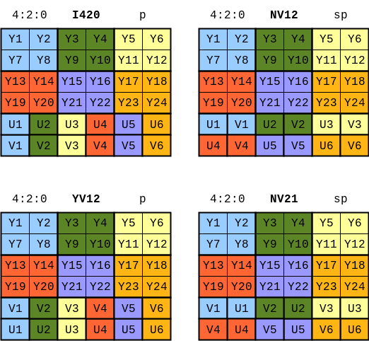

[TOC]


# 视音频数据处理入门


## 1. RGB、YUV像素数据处理[^1]

### 1.1. 分离YUV420P像素数据中的Y、U、V分量

如果视频帧的宽和高分别为w和h，那么一帧 `YUV420P` 像素数据一共占用 `w*h*3/2` Byte的数据。其中前 `w*h` Byte存储Y，接着的 `w*h*1/4` Byte存储U，最后 `w*h*1/4` Byte存储V。

### 1.2. 分离YUV444P像素数据中的Y、U、V分量

如果视频帧的宽和高分别为w和h，那么一帧 `YUV444P` 像素数据一共占用 `w*h*3` Byte的数据。其中前 `w*h` Byte存储Y，接着的 `w*h` Byte存储U，最后 `w*h` Byte存储V。

`YUV` 不同格式存储方式如下



### 1.3. 将YUV420P像素数据去掉颜色（变成灰度图）

如果想把YUV格式像素数据变成灰度图像，只需要将U、V分量设置成128即可。这是因为U、V是图像中的经过偏置处理的色度分量。色度分量在偏置处理前的取值范围是-128至127，这时候的无色对应的是0值。经过偏置后色度分量取值变成了0至255，因而此时的无色对应的就是128了。

### 1.4. 将YUV420P像素数据的亮度减半

如果打算将图像的亮度减半，只要将图像的每个像素的Y值取出来分别进行除以2就可以了。

### 1.5. 将YUV420P像素数据的周围加上边框

将距离图像边缘 `border` 范围内的像素的亮度分量Y的取值设置成了亮度最大值255（白色）或者0（黑色）。

### 1.6. 生成YUV420P格式的灰阶测试图

灰度与Y值有关。

### 1.7. 计算两个YUV420P像素数据的PSNR

$$
\begin{align}
    MSE &= \frac{1}{M*N}\sum_{i=1}^{M}\sum_{j=1}^{N}(X_{ij}-Y_{ij})^2 \\
    PSNR &= 10\log_{10}(\frac{255^2}{MSE})
\end{align}
$$

其中M，N分别为图像的宽高，$X_{ij}$ 和 $Y_{ij}$ 分别为两张图像的每一个像素值。`PSNR` 通常用于质量评价，就是计算受损图像与原始图像之间的差别，以此来评价受损图像的质量。

### 1.8. 分离RGB24像素数据中的R、G、B分量

与 `YUV420P` 三个分量分开存储不同， `RGB24` 格式的每个像素的三个分量是连续存储的。

### 1.9. 将RGB24格式像素数据封装为BMP图像

- 将 `RGB` 数据前面加上文件头。
- 将 `RGB` 数据中每个像素的 B 和 R 的位置互换。

### 1.10. 将RGB24格式像素数据转换为YUV420P格式像素数据

$$
\begin{aligned}
    Y &= 0.299R + 0.587G + 0.114B \\
    U &= -0.147R - 0.289G + 0.436B \\
    V &= 0.615R - 0.515G - 0.100B
\end{aligned}
$$

- `RGB24` 存储方式是 Packed，`YUV420P` 存储方式是 Packed。
- U，V在水平和垂直方向的取样数是Y的一半。

### 1.11. 生成RGB24格式的彩条测试图

| 颜色 | (R, G, B)       |
| ---- | --------------- |
| 白   | (255, 255, 255) |
| 黄   | (255, 255,  0)  |
| 青   | ( 0, 255, 255)  |
| 绿   | ( 0, 255,  0)   |
| 品   | (255,  0, 255)  |
| 红   | (255,  0,  0)   |
| 蓝   | ( 0,  0, 255)   |
| 黑   | ( 0,  0,  0)    |


## 2. PCM音频采样数据处理[^2]

### 2.1. 分离PCM16LE双声道音频采样数据的左声道和右声道

`PCM16LE` 双声道数据中左声道和右声道的采样值是间隔存储的。每个采样值占用 `2 Byte` 空间。

### 2.2. 将PCM16LE双声道音频采样数据中左声道的音量降一半

在读出左声道的 `2 Byte` 的取样值之后，将其当成了C语言中的一个 `short` 类型的变量。将该数值除以2之后写回到了 `PCM` 文件中。

### 2.3. 将PCM16LE双声道音频采样数据的声音速度提高一倍

直接将采样点缩减一半。

### 2.4. 将PCM16LE双声道音频采样数据转换为PCM8音频采样数据

`PCM16LE` 格式的采样数据的取值范围是 -32768 到 32767，而 `PCM8` 格式的采样数据的取值范围是 0 到 255。所以 `PCM16LE` 转换到 `PCM8` 需要经过两个步骤：第一步是将 -32768 到 32767 的 `16bit` 有符号数值转换为 -128 到 127 的 `8bit` 有符号数值，第二步是将 -128 到 127 的 `8bit` 有符号数值转换为 0 到 255 的 `8bit` 无符号数值。

### 2.5. 从PCM16LE单声道音频采样数据中截取一部分数据

### 2.6. 将PCM16LE双声道音频采样数据转换为WAVE格式音频数据


## 3. H.264视频码流解析[^3]

`H.264` 原始码流（又称为“裸流”）是由一个一个的 `NALU` 组成的。

`NALU = NALU header + NALU payload`，下图显示的是 `NALU header`


- `F`（forbidden_zero_bit）：1 位，初始为 0。当网络识别此单元存在比特错误时，可将其设为 1，以便接收方丢掉该单元
- `NRI`（nal_ref_idc）：2 位，用来指示该 `NALU` 的重要性等级。值越大，表示当前 `NALU` 越重要。具体大于 0 时取何值，没有明确规定
- `Type`（nal_unit_type）：5 位，指出 `NALU` 的类型


## 4. AAC音频码流解析[^4]

AAC原始码流（又称为“裸流”）是由一个一个的ADTS frame组成的。

`ADTS` 帧首部结构

| 字母 | 长度（位） | 描述                                                                                                                                        |
| :--- | :--------- | :------------------------------------------------------------------------------------------------------------------------------------------ |
| A    | 12         | 同步字（所有位必须设置为1）                                                                                                                 |
| B    | 1          | MPEG版本，设置为0表示MPEG-4，设置为1表示MPEG-2                                                                                              |
| C    | 2          | Layer，始终设置为0                                                                                                                          |
| D    | 1          | CRC校验位，如果没有CRC，则设置为1，如果有CRC，则设置为0                                                                                     |
| E    | 2          | Profile，MPEG-4音频对象类型减去1                                                                                                            |
| F    | 4          | MPEG-4采样频率索引（禁止使用15）                                                                                                            |
| G    | 1          | 私有位，MPEG保证不使用，编码时设置为0，解码时忽略                                                                                           |
| H    | 3          | MPEG-4声道配置（如果为0，则通过内部的PCE（程序配置元素）发送声道配置）                                                                      |
| I    | 1          | 原始性，设置为1表示音频为原始内容，设置为0表示非原始内容                                                                                    |
| J    | 1          | 家庭使用，设置为1表示音频为家庭使用，设置为0表示非家庭使用                                                                                  |
| K    | 1          | 版权标识位，用于传输中心注册的版权标识符的下一位，以LSB优先顺序滑动位字符串，将当前位值放在该字段中，如果到达末尾，则回到开头（循环缓冲区） |
| L    | 1          | 版权标识起始位，设置为1表示该帧的版权标识位为第一个，否则设置为0                                                                            |
| M    | 13         | 帧长度，包括ADTS头部和CRC校验的长度                                                                                                         |
| O    | 11         | 缓冲区满度，表示每帧的位保留池状态                                                                                                          |
| P    | 2          | AAC帧数减1（RDBs（原始数据块）在ADTS帧中），为确保最大兼容性，请始终每个ADTS帧使用一个AAC帧                                                 |
| Q    | 16         | CRC校验（根据ISO/IEC 11172-3，条款2.4.3.1），如果Protection absent为0，则存在CRC校验位                                                      |


## 5. FLV封装格式解析[^5]

`FLV` 封装格式是由一个 `FLV Header` 文件头和一个一个的 `Tag` 组成的。 `Tag` 中包含了音频数据以及视频数据。


## 6. UDP-RTP协议解析[^6]

```cpp
/**
 *    0                   1                   2                   3
 *    7 6 5 4 3 2 1 0|7 6 5 4 3 2 1 0|7 6 5 4 3 2 1 0|7 6 5 4 3 2 1 0
 *   +-+-+-+-+-+-+-+-+-+-+-+-+-+-+-+-+-+-+-+-+-+-+-+-+-+-+-+-+-+-+-+-+
 *   |V=2|P|X|  CC   |M|     PT      |       sequence number         |
 *   +-+-+-+-+-+-+-+-+-+-+-+-+-+-+-+-+-+-+-+-+-+-+-+-+-+-+-+-+-+-+-+-+
 *   |                           timestamp                           |
 *   +-+-+-+-+-+-+-+-+-+-+-+-+-+-+-+-+-+-+-+-+-+-+-+-+-+-+-+-+-+-+-+-+
 *   |           synchronization source (SSRC) identifier            |
 *   +=+=+=+=+=+=+=+=+=+=+=+=+=+=+=+=+=+=+=+=+=+=+=+=+=+=+=+=+=+=+=+=+
 *   |            contributing source (CSRC) identifiers             |
 *   :                             ....                              :
 *   +-+-+-+-+-+-+-+-+-+-+-+-+-+-+-+-+-+-+-+-+-+-+-+-+-+-+-+-+-+-+-+-+
 */
struct RtpHeader
{
    /* byte 0 */
    uint8_t csrcLen     : 4; // CSRC计数器，占4位，指示CSRC 标识符的个数。
    uint8_t extension   : 1; // 占1位，如果X=1，则在RTP报头后跟有一个扩展报头。
    uint8_t padding     : 1; // 填充标志，占1位，如果P=1，则在该报文的尾部填充一个或多个额外的八位组，它们不是有效载荷的一部分。
    uint8_t version     : 2; // RTP协议的版本号，占2位，当前协议版本号为2。

    /* byte 1 */
    uint8_t payloadType : 7; // 有效载荷类型，占7位，用于说明RTP报文中有效载荷的类型，如GSM音频、JPEM图像等。
    uint8_t marker      : 1; // 标记，占1位，不同的有效载荷有不同的含义，对于视频，标记一帧的结束；对于音频，标记会话的开始。

    /* bytes 2,3 */
    uint16_t seq; // 占16位，用于标识发送者所发送的RTP报文的序列号，每发送一个报文，序列号增1。接收者通过序列号来检测报文丢失情况，重新排序报文，恢复数据。

    /* bytes 4-7 */
    uint32_t timestamp; // 占32位，时戳反映了该RTP报文的第一个八位组的采样时刻。接收者使用时戳来计算延迟和延迟抖动，并进行同步控制。

    /* bytes 8-11 */
    uint32_t ssrc; // 占32位，用于标识同步信源。该标识符是随机选择的，参加同一视频会议的两个同步信源不能有相同的SSRC。

    /**
     * 标准的RTP Header 还可能存在 0-15个特约信源(CSRC)标识符
     * 每个CSRC标识符占32位，可以有0～15个。每个CSRC标识了包含在该RTP报文有效载荷中的所有特约信源
     */
};
```


# 参考

[^1]: [视音频数据处理入门：RGB、YUV像素数据处理](https://blog.csdn.net/leixiaohua1020/article/details/50534150)
[^2]: [视音频数据处理入门：PCM音频采样数据处理](https://blog.csdn.net/leixiaohua1020/article/details/50534316)
[^3]: [视音频数据处理入门：H.264视频码流解析](https://blog.csdn.net/leixiaohua1020/article/details/50534369)
[^4]: [视音频数据处理入门：AAC音频码流解析](https://blog.csdn.net/leixiaohua1020/article/details/50535042)
[^5]: [视音频数据处理入门：FLV封装格式解析](https://blog.csdn.net/leixiaohua1020/article/details/50535082)
[^6]: [视音频数据处理入门：UDP-RTP协议解析](https://blog.csdn.net/leixiaohua1020/article/details/50535230)
